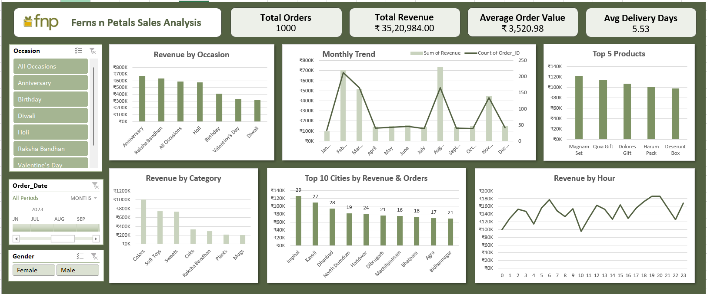

# Ferns-N-Petals-Analysis

## Project Overview

The **Ferns & Petals Sales Analysis** project analyzes sales performance across products, categories, cities, occasions, customers, and time periods.
It replicates a **real-world BI workflow** used for sales monitoring and decision-making.
The goal is to derive actionable insights to help optimize sales strategy and improve customer satisfaction.

## Dashboard

## Key Business Questions Answered

1. **Total Revenue** – What is the overall revenue generated?
2. **Average Order & Delivery Time** – How efficient are order processing and delivery?
3. **Monthly Sales Performance** – How do sales trends vary across the months of 2023?
4. **Top Products by Revenue** – Which products generate the highest revenue?
5. **Customer Spending Analysis** – What is the average customer spending behavior?
6. **Top 5 Product Performance** – How do the top five products perform in terms of sales?
7. **Top 10 Cities by Orders** – Which cities generate the highest number of orders?
8. **Order Quantity vs. Delivery Time** – Does order quantity affect delivery time?
9. **Revenue by Occasion** – How does revenue vary across different occasions?
10. **Product Popularity by Occasion** – Which products are most popular for specific occasions?

## Tools Used

* Microsoft Excel
* Power Query Editor
* Power Pivot
* Pivot Tables & Pivot Charts
* DAX

## Steps of the Project

1. **Data Understanding:** Reviewed orders, products, and customer data to understand the fields and business requirements.
2. **ETL with Power Query:** Imported three Excel files, corrected data types and inconsistencies, merged tables, and created columns for monthly analysis and delivery time.
3. **Data Modelling:** Established relationships between tables using a star schema and created calculated columns using DAX.
4. **Data Analysis:** Created Pivot Tables and measures to analyze monthly revenue, orders, products, customers, and occasions.
5. **Dashboard:** Built an interactive Excel dashboard using charts, slicers, and timelines.
6. **Insights & Recommendations:** Identified key trends and developed business recommendations based on the analysis, with AI tools used as a supporting resource where appropriate.

## Key Insights

### Overall Business Performance

* **Total Orders:** 1,000
* **Total Revenue:** ₹35,20,984
* **Average Order Value:** ₹3,520.98
* **Average Delivery Time:** 5.5 days

### Sales & Category Performance

* **Colors, Soft Toys, and Sweets** together contribute around **70% of total revenue**, making them key categories for inventory planning and promotional campaigns.
* **Anniversary** has the highest order volume with **205 orders** and approximately **₹6.75L revenue**, while its AOV remains moderate.
* **Raksha Bandhan** generates high revenue despite fewer orders, driven by a significantly higher AOV.
* **Holi** shows strong demand but has a relatively lower AOV.
* **Diwali** has the lowest order volume at **95 orders**, but a relatively high AOV of **₹3,303**, suggesting an opportunity to focus on increasing order acquisition.
* Sales show seasonal fluctuations, with strong revenue peaks in **February, August, and November**.

### Customer & Geographic Performance

* Customer spending varies by city, with cities having similar order volumes generating different levels of revenue.
* Male customers contribute slightly higher revenue, order volume, and AOV across most occasions, while **Birthdays are an exception where female customers perform better**.
* The strongest revenue period appears to be during the **evening hours between 6 PM and 9 PM**.

## Recommendations

* Use **targeted promotions before peak festive periods** to increase order volume.
* Introduce **add-ons and premium versions of popular products** to increase basket value.
* Create **"Complete the Gift" recommendations** to encourage cross-selling.
* Align **inventory, marketing, and staffing** with high-performing periods such as February, August, and November.
* Test promotional campaigns during **high-performing evening hours** through notifications and email campaigns.
* Target female customers with **premium birthday bundles and personalized birthday offers**, while maintaining occasion-specific promotions for the male segment.
